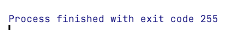

## Exercise 1.1

> Review the documentation for your compiler and determine what file naming convention it uses. Compile and run the main
> program from page 2.

## Exercise 1.2

> Change the program to return -1. A return value of -1 is often treated as an indicator that the program failed.
> Recompile and rerun your program to see how your system treats a failure indicator from main.

### Mac



**255**? why? please look at [this](http://www.tldp.org/LDP/abs/html/exitcodes.html)

## Exercise 1.3

> Write a program to print Hello, World on the standard output.

[ex1_3](ex1_3.cpp)

## Exercise 1.4

> Our program used the addition operator, +, to add two numbers. Write a program that uses the multiplication
> operator, *, to print the product instead.

[ex1_4](ex1_4.cpp)

## Exercise 1.5

> We wrote the output in one large statement. Rewrite the program to use a separate statement to print each operand.

[ex1_5](ex1_5.cpp)

## Exercise 1.6

> Explain whether the following program fragment is legal.

```c++
std::cout << "The sum_while of " << v1;
          << " and " << v2;
          << " is " << v1 + v2 << std::endl;
```

It's illegal.

**[Error] expected primary-expression before '<<' token**

Fixed it: remove the spare semicolons or add std::cout in statement head.

```cpp
std::cout << "The sum_while of " << v1 << " and " << v2 << " is " << v1 + v2 << std::endl;
```

## Exercise 1.7

> Compile a program that has incorrectly nested comments.

## Exercise 1.8

> Indicate which, if any, of the following output statements are legal:

```cpp
std::cout << "/*";
std::cout << "*/";
std::cout << /* "*/" */;
std::cout << /* "*/" /* "/*" */;
```

## Exercise 1.9

> Write a program that adds the integers form 50 to 100 using a while loop.

[ex1_9](ex1_9.cpp)

## Exercise 1.10

[ex1_10](ex1_10.cpp)

## Exercise 1.11

[ex1_11](ex1_11.cpp)

## Exercise 1.12

> What does the following for loop do? What is the final value
> of sum_while?

```cpp
int sum_while = 0;
for (int i = -100; i <= 100; ++i)
    sum_while += i;
```

the loop sums the numbers from -100 to 100. the final value of sum_while is zero.

## Exercise 1.13

> Rewrite the exercises from § 1.4.1 (p. 11) using for loops.

[ex1_9](ex1_9.cpp)

[ex1_10](ex1_10.cpp)

[ex1_11](ex1_11.cpp)

## Exercise 1.14

> Compare and contrast the loops that used a for with those
> using a while. Are there advantages or disadvantages to using either form?

[A similar question on Stack Overflow](http://stackoverflow.com/questions/2950931/for-vs-while-in-c-programming)

## Exercise 1.15

> Write programs that contain the common errors discussed in
> the box on page 16. Familiarize yourself with the messages the compiler
> generates.

**Syntax Errors**:

```c++
int main(){
    std::cout << "Hello World!" << std::endl // semicolon missed 
    return 0;
}
```

**Type errors**:

```c++
int main(){
    char s = "Hello World!"; // Here char should be std::string
    std::cout << s << endl;
    return 0;
}
```

**Declaration errors**:

```c++
int main(){
    int k = 0;
    std::cout << K << std::endl; // use of undeclared identifier 'K'
    return 0;
}
```

## Exercise 1.16

> Write a program read numbers from cin, print sum result

[ex1_16](ex1_16.cpp)

## Exercise 1.17

> What happens in the program presented in this section if the input values are all equal? What if there are no
> duplicated values?

If the input values are all equal, it will print a line which shows the count of the number you input.

If there are no duplicated values, when different values input, a new line will be printed if you click `Enter`.

## Exercise 1.18

> Compile and run the program from this section giving it only equal values as input. Run it again giving it values in
> which no number is repeated.

